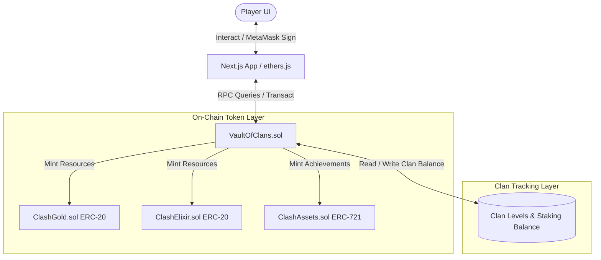

# 🏰 Vault of Clans — Web3 Village Builder & DeFi Staking

🛡️ **Build your village, train your army, and stake your assets in a gamified decentralized finance strategy simulator.**

[](https://soliditylang.org/)
[](https://www.typescriptlang.org/)
[](https://react.dev/)
[](https://nextjs.org/)
[](https://tailwindcss.com/)
[](https://book.getfoundry.sh/)
[](https://www.python.org/)
[](#-testing-suite)
[](https://github.com/lazyKid64/VaultOfClans)

🔗 **Live Deployment:** [https://vault-of-clans.vercel.app/](https://vault-of-clans.vercel.app/)

---

## 🎮 Introduction

**Vault of Clans** is a decentralized Web3 strategy and village-building application that wraps complex decentralized finance (DeFi) yield actions in an interactive, gamified strategy wrapper. 

Instead of staring at dry charts and basic tables, players interact with a premium isometric 3D village grid. Depositing assets translates directly to constructing and stocking your treasury, while time-locking liquidity yields powerful troop units, generating village experience ($XP$) and unlocking fee reduction benefits.

---

## 🛠️ Technology Stack & Beginner Level Classification

This repository is designed as a **beginner-friendly dApp template** showcasing how to bind core on-chain standards (ERC-20, ERC-1155) and custom vault time-locking mechanics to a modern client application.

### ⛓️ Blockchain & Smart Contracts
*   **Solidity (0.8.20):** High-level object-oriented programming language for writing smart contracts.
*   **OpenZeppelin Contracts (v5.0.0):** Standard library for secure contract implementations, specifically:
    *   `ERC20` (Standard for gold and elixir resource fungible tokens)
    *   `ERC1155` (Multi-token standard for semi-fungible army unit assets)
    *   `Ownable` (Access control mechanism to lock admin configurations)
*   **Foundry (Forge & Anvil):** Blazing fast testing, compilation, and deployment framework.
*   **Forge-Std:** Standard testing library for Forge unit assertions and environment cheats.

### 🌐 Frontend & User Interface (TypeScript)
*   **React (19.2.0) & Next.js (16.0.10 App Router):** Core UI component library and static rendering framework.
*   **TypeScript:** Strictly-typed superscript of JavaScript for type-safe contract interfaces and components.
*   **Ethers.js (v6.16.0):** Complete library for interacting with the Ethereum Blockchain and its nodes.
*   **Tailwind CSS (v4.1.9):** Utility-first CSS framework for custom responsive village styling.
*   **Radix UI (Primitives):** Unstyled, accessible React components utilized for dashboard popovers, dialogs, switch toggles, tabs, tooltips, dropdowns, and progress bars.
*   **Vaul:** Mobile-ready unstyled drawer component for sliding panels.
*   **Recharts (2.15.4):** Composited charts library for treasury growth history visualization.
*   **Lucide React:** Clean icon asset library representing game resources and statistics.
*   **React Hook Form & Zod:** Type-safe form validation for deposit amount inputs and training locks.
*   **Embla Carousel React:** Touch-ready carousel component for switching troop cards.
*   **Vercel Analytics:** Client-side telemetry tracking for live deployment performance.
*   **PostCSS & Autoprefixer:** CSS parsing and compilation utilities.
*   **UI Helpers:** `clsx`, `tailwind-merge`, `class-variance-authority` (CVA), `tailwindcss-animate`, `tw-animate-css` (for smooth village layout entry animations).

### ⚙️ Scripting & Local Automation
*   **Python (3.x):** Used for local utility scripts (such as image boundary cleanup and git restructuring).
*   **Bash / Shell:** System command triggers for compiling smart contracts, generating snapshots, and running tests.

---


## 🌐 Deployed Smart Contract Addresses (Sepolia Testnet)

The project contracts are compiled and deployed on the **Ethereum Sepolia Testnet** for real blockchain interaction:

| Contract | Purpose | Deployed Address |
|---|---|---|
| **VaultOfClans** | Core staking vault and troop training | [`0x636Ff98761076f641e724EdAF1B0B452C20Cc783`](https://sepolia.etherscan.io/address/0x636Ff98761076f641e724EdAF1B0B452C20Cc783) |
| **ClashGold** | In-game $GOLD resource token (ERC-20) | [`0xB5126dfC0158DfA1c6cd6a78CcEc759B00D6f260`](https://sepolia.etherscan.io/address/0xB5126dfC0158DfA1c6cd6a78CcEc759B00D6f260) |
| **ClashElixir** | In-game $ELIXIR resource token (ERC-20) | [`0x0599927D3a61904199F386265370F01198F722E5`](https://sepolia.etherscan.io/address/0x0599927D3a61904199F386265370F01198F722E5) |
| **ClashAssets** | Village building & troop assets (ERC-1155) | [`0xAAe15788ed6bfa51AE61F2987eB3aB637cF22148`](https://sepolia.etherscan.io/address/0xAAe15788ed6bfa51AE61F2987eB3aB637cF22148) |

---


## ⚔️ Gameplay Mechanics vs. On-Chain Actions

Every in-game village action executes a corresponding state mutation on the Ethereum blockchain.

| In-Game Action | On-Chain Operation | Mechanic & Requirements | Player Benefit |
|---|---|---|---|
| **Stock Treasury** | `deposit()` | Staking $ETH$ into the core Vault contract. | Increases earning balance; generates base resource points. |
| **Train Barbarian** | `spendResources()` | Burn in-game ERC-20 resources (`$GOLD` & `$ELIXIR`). | Generates basic military power; counts towards troop totals. |
| **Train Wizard** | `trainWizard(days)` | Lock staked $ETH$ inside the Vault for **1 to 7 days**. | Larger locks yield more Wizard units and boost $XP$ generation. |
| **Train Giant** | `trainGiant()` | Direct deposit transaction of **0.2 ETH** to the Vault. | Adds to active stake. Training $\ge 3$ Giants reduces withdraw fee by 90%. |
| **Join Clan** | `joinClan(clanId)` | Registers wallet address to a dynamic Clan index. | Combines stake to level up the Clan for shared multiplier perks. |
| **Claim Loot** | `withdraw(amount)` | Standard yield and principal unstaking request. | Redeems $ETH$ back to user wallet. Subject to timelocks. |

---

## 📂 Repository Folder Structure

The project has a monorepo structure separating the Ethereum Solidity smart contracts and Next.js frontend application:

```text
VaultOfClans/
├── .github/workflows/      # CI/CD pipelines
│   └── test.yml            # Automated Forge tests action
├── script/                 # Contract deployment and migration scripts
│   └── DeployAll.s.sol     # Main Deployment Script
├── src/                    # Core Smart Contracts (EVM logic)
│   ├── ClashAssets.sol     # ERC-1155 game units (semi-fungible)
│   ├── ClashElixir.sol     # ERC-20 elixir resource token
│   ├── ClashGold.sol       # ERC-20 gold resource token
│   └── VaultOfClans.sol    # Core staking vault & game rules engine
├── test/                   # Smart Contract testing suite
│   └── VaultOfClans.t.sol  # Unit and fuzz tests (57 test cases)
├── frontend/               # Next.js web application (React, TS)
│   ├── app/                # Next.js App Router (pages: village, clan, army, treasury)
│   ├── components/         # Game components (isometric grid, troop cards, modal UIs)
│   ├── hooks/              # Custom React hooks (wallet connect, contract reading/writing)
│   ├── lib/                # Shared utilities and smart contract configuration constants
│   └── public/             # Static game image assets (transparent PNGs)
├── foundry.toml            # Foundry (Forge/Anvil) compiler and profile configuration
└── README.md               # Main project documentation
```

---

## 🏗️ System Architecture

The interaction flow between player actions, the frontend layer, and the core smart contracts:



---

## 📄 Smart Contracts in Detail

The business logic of the dApp resides in the following Solidity contracts inside `dApp/src/`:

### 1. Core Vault (`VaultOfClans.sol`)
The central coordinator that handles staking, time-locking, fee adjustments, and troop state changes.
*   **State Mappings:**
    *   `balance[address] => uint256`: Active staked ETH principal for each user.
    *   `troops[address][uint8] => uint256`: Count of active troops (0: Barbarian, 1: Archer, 2: Giant, 3: Wizard) for each player.
    *   `trainingEnd[address] => uint256`: The Unix timestamp when a user's active wizard-training timelock expires.
    *   `feeReduced[address] => bool`: Tracks whether the user is currently qualified for the 90% fee reduction discount.
    *   `clanOf[address] => uint256`: The current Clan ID that the player belongs to (0 if none).
    *   `clans[clanId] => Clan`: Struct storing collective `totalBalance` and `level` (increases by 1 for every 5 ETH deposited by members).
*   **Core Mechanics & Functions:**
    *   `deposit() external payable`: Stakes arbitrary ETH. Credits `balance[msg.sender]` and triggers `goldToken.mint()` and `elixirToken.mint()` to grant in-game resource points at a 1:1 ratio.
    *   `trainWizard(uint256 daysLocked) external`: Locks the user's staked principal for a duration of $1$ to $7$ days. Increments the Wizard count and updates the `trainingEnd[msg.sender]` lock timestamp.
    *   `trainGiant() external payable`: Stakers recruit Giants by sending exactly `0.2 ETH`. The ETH is added directly to their active stake (`balance`). If Giant count reaches $\ge 3$, it toggles `feeReduced[msg.sender] = true`.
    *   `withdraw(uint256 amount) external`: Unstakes ETH. Reverts if `block.timestamp < trainingEnd[msg.sender]`. Calculates the exit fee, deducts `amount` from `balance`, increases the vault's `accumulatedFees`, and forwards `amount - fee` to the player.
    *   `joinClan(uint256 clanId) external`: Registers the user's address to the new clan. Adds their staked balance to the clan's pool and levels up the clan dynamically.

### 2. Resource Tokens (`ClashGold.sol` & `ClashElixir.sol`)
Standard ERC-20 tokens representing in-game resources.
*   Uses a custom `onlyMinter` modifier restrictively set to the `VaultOfClans` deployment address.
*   Automatically minted to users upon `deposit()` and burned from users when they recruit Barbarians or upgrade.

### 3. Troop NFTs (`ClashAssets.sol`)
Standard **ERC-1155** semi-fungible token contract tracking player army cards.
*   Token IDs mapped to troop units: `Barbarian = 0`, `Archer = 1`, `Giant = 2`, `Wizard = 3`.
*   Invoked by the `VaultOfClans` minter address during troop training to issue ownership certificates of game units directly to the player's wallet.

---

## ⚙️ Giant Fee Reduction Algorithm

Staking withdrawals are subject to a **5.0% standard withdrawal fee** (500 BPS) used to incentivize the ecosystem. However, if a player has trained $\ge 3$ Giants, their withdrawal fee is slashed by **90%** down to **0.5%** (50 BPS).

### Complete Formula & Staking State Changes:
1.  **Fee Rate Lookup:**
    $$\text{feeBps} = \begin{cases} 
          50 \text{ BPS } (0.5\%) & \text{if } \text{feeReduced[msg.sender] is true} \\
          500 \text{ BPS } (5.0\%) & \text{otherwise}
       \end{cases}$$
2.  **Fee Calculation:**
    $$\text{feeAmount} = \frac{\text{amount} \times \text{feeBps}}{10,000}$$
3.  **State Deductions:**
    $$\text{balance[msg.sender]} = \text{balance[msg.sender]} - \text{amount}$$
    $$\text{accumulatedFees} = \text{accumulatedFees} + \text{feeAmount}$$
4.  **Payout Execution:**
    The contract transfers exactly $\text{amount} - \text{feeAmount}$ to the player's wallet. The user's active vault balance is reduced by the full requested `amount` (covering both the payout and the fee).

---

## 🕹️ End-to-End User Gameplay Workflow

A player's journey from landing on the dApp to withdrawing funds follows a structured flow:

```
[Connect Wallet] ➔ [Deposit ETH] ➔ [Train Troops] ➔ [Join Clan] ➔ [Wait Lock] ➔ [Withdraw with Discount]
```

1.  **Mobilization:** The player opens the dashboard and connects their MetaMask wallet on the Sepolia Testnet.
2.  **Establish Staking Principal:** The player stakes ETH (e.g. 1.0 ETH) on the **Treasury** page, minting 1000 `$GOLD` and 1000 `$ELIXIR` resource tokens.
3.  **Recruit Army & Activate Locks:** 
    *   The player navigates to the **Army** page and burns Gold/Elixir to train basic Barbarians.
    *   To boost their $XP$, they train a Wizard, choosing a **4-day lock**. The vault freezes their 1.0 ETH principal until the 4 days expire.
    *   They train 3 Giants by sending `0.6 ETH` (`3 x 0.2 ETH`) to the vault, bringing their total stake to 1.6 ETH.
4.  **Unlock Fee Reduction:** As soon as the 3rd Giant is trained, `feeReduced` toggles to `true` for their wallet address.
5.  **Clan Affiliation:** The player joins a Clan (e.g. Clan #1) on the **Clan** page. Their 1.6 ETH stake is added to the Clan pool, increasing the Clan's level and unlocking shared yield multiplier benefits.
6.  **Unstaking Principal & Yield:** Once the 4-day Wizard lock expires, the player requests a withdrawal of 1.0 ETH. 
    *   Because they own 3 Giants, the fee is only 0.005 ETH (0.5%).
    *   Their vault balance drops to 0.6 ETH.
    *   They receive 0.995 ETH in their wallet.

---


## 🖼️ Frontend Layout

The client dashboard compiles into 5 core views:
1.  **Landing Page (`/`):** Dynamic wallet connection interface with MetaMask connection states.
2.  **Village Grid (`/village`):** Isometric layout displaying the Town Hall, Barracks, Army Camp, Treasury, and Clan Castle. Displays live $XP$ level and token resource HUDs.
3.  **Army Camp (`/army`):** Interface to view active troop configurations, train Wizards with custom day locks, and purchase Giants.
4.  **Treasury Panel (`/treasury`):** Clean deposit and withdrawal terminal with dynamic fee calculations, max-balance selectors, and active timelock countdown progress bars.
5.  **Clan Portal (`/clan`):** Interface to join clans, view collective staking pools, and monitor clan upgrade levels.

---

## 🚀 Installation & Running Locally

### Prerequisites
*   [Rust & Foundry](https://book.getfoundry.sh/getting-started/installation)
*   [Node.js (v18+)](https://nodejs.org/)

### 1. Smart Contract Sandbox (Anvil)
In your terminal, navigate to the `dApp/` root directory and start the local EVM node:
```bash
anvil
```

### 2. Compile & Deploy Contracts
Deploy the contracts to the local sandbox using Forge:
```bash
# Compile Solidity files
forge build

# Deploy to Anvil
forge script script/DeployAll.s.sol --fork-url http://localhost:8545 --broadcast
```

### 3. Start Frontend Dev Server
Navigate to the `frontend` folder, install dependencies, and start Next.js:
```bash
cd frontend

# Install package dependencies
npm install

# Start Next.js App Router in dev mode
npm run dev
```
Open `http://localhost:3000` in your browser. Configure MetaMask to connect to `Localhost 8545` (Chain ID `31337`).

---

## 🧪 Testing Suite

Vault of Clans features a comprehensive unit-test and fuzz-testing suite containing **57 check cases** in [VaultOfClans.t.sol](file:///c:/MinGW/CoC-dApp/week3-dApp/dApp/test/VaultOfClans.t.sol) to enforce security.

To run the entire suite and view gas snapshot reports:
```bash
# Run unit and fuzz tests
forge test -vvv

# Generate gas snapshots
forge snapshot
```

The test coverage guarantees:
*   **Security Bounds:** Verifies reentrancy guards and access control bounds for admin withdrawals.
*   **Timelock Validation:** Enforces locked balances cannot be withdrawn under any circumstances before `unlockTime`.
*   **Fuzz Testing:** Runs multiple randomized inputs on deposit limits, fee calculations, and clan switching to avoid calculation overflow.

---

## 🌐 Vercel Deployment Guide

To deploy the Next.js frontend of **Vault of Clans** to Vercel:

1. **Push to GitHub:** Ensure your latest commits are pushed to your remote repository (e.g., `https://github.com/lazyKid64/VaultOfClans`).
2. **Import Project on Vercel:**
   * Go to the [Vercel Dashboard](https://vercel.com/) and click **Add New** -> **Project**.
   * Import your `VaultOfClans` repository.
3. **Configure Project Settings:**
   * **Root Directory:** Set this to `frontend`. Since the Next.js app is located in the `frontend` subfolder, specifying the root directory is required for Vercel to find the build configuration.
   * **Framework Preset:** Next.js (detected automatically).
   * **Build & Development Settings:** Leave as default.
4. **Environment Variables:**
   * If deploying to Sepolia or a custom testnet, you can supply public environment variables as required by Next.js.
5. **Deploy:** Click **Deploy**. Vercel will build and host your Web3 client.

---

## 📄 License

This project is licensed under the MIT License - see the [LICENSE](file:///c:/MinGW/CoC-dApp/week3-dApp/dApp/LICENSE) file for details.
